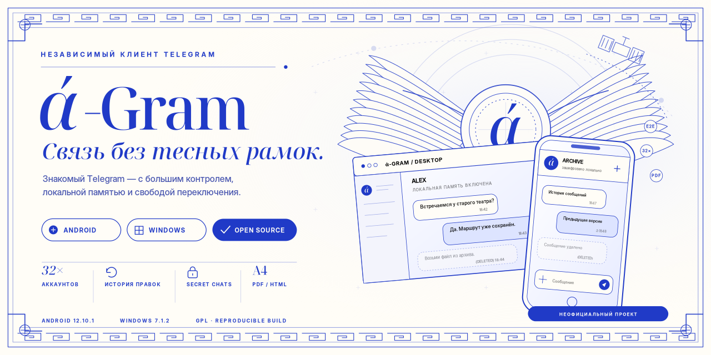

# ά‑Gram

ά‑Gram — экспериментальный неофициальный клиент Telegram для Android и Windows. Проект основан на открытых исходниках Telegram Android и Telegram Desktop и распространяется вместе с инструкциями для воспроизводимой сборки.

## Состав репозитория

- [`android/`](android/) — overlay `12.10.1-a-gram.19` для официального Telegram Android.
- [`windows/`](windows/) — overlay `7.1.2-a-gram.17` для Telegram Desktop.

В репозитории хранятся только изменённые файлы поверх зафиксированных upstream-коммитов. Базовые репозитории, версии инструментов и порядок сборки указаны в README внутри каждой платформы.

## Готовые сборки

Актуальные APK, Windows installer и portable ZIP публикуются в [GitHub Releases](https://github.com/oxyderkes/a-Gram/releases). Бинарные файлы намеренно не хранятся в истории Git.

## Основные изменения

- до 32 локальных слотов аккаунтов без Premium-ограничения интерфейса;
- поэтапный запуск фоновых аккаунтов и защита от повторного переключения;
- завершённые и отозванные сессии удаляются из переключателя, а их слот сразу освобождается для нового входа;
- сохранение полученных сообщений после серверного удаления с локальной меткой;
- локальная история редактирований и фоновая загрузка медиа;
- Ghost Mode: быстрый переключатель в шапке диалогов, отдельное состояние каждого контейнера, подавление read/story/typing/online-сигналов, чтение при взаимодействии и предупреждения перед раскрывающими активность действиями;
- при обычном открытии чата в Ghost Mode локальный счётчик непрочитанных и системное уведомление сохраняются до явной команды «Пометить прочитанным»;
- просмотр истории в Ghost Mode сохраняет её локальную отметку «не просмотрено» и предупреждает перед открытием и отправкой реакции;
- один Telegram-аккаунт всегда получает один контейнер автоматически: отдельный выбор контейнера на старте удалён;
- до входа доступны генерация профиля, 10 стандартных пресетов и ручные модель/версия Android; версия Agram и `api_id` всегда настоящие, а профиль фиксируется после авторизации;
- отдельный сетевой режим каждого контейнера: direct, свой SOCKS5/MTProto proxy или встроенный Tor с fail-closed kill switch;
- в шапке диалогов показываются только режим и состояние маршрута; IP и приблизительное гео текущей Telegram-сессии перенесены в отдельный экран «Tor и маршрут»;
- запуск Tor контролируется одним фоновым bootstrap-процессом с прогрессом 0–100%, таймаутом и чистым пересозданием остановившегося TorService; первичная ошибка сохраняется, а соединение остаётся fail-closed;
- устранён стартовый ANR Android Keystore: проверка push-идентификаторов больше не расшифровывает хранилища всех аккаунтов, а неподнятая во время запуска сессия не принимается за завершённую;
- встроенный Agram Push без внешнего дистрибьютора: отдельный случайный endpoint и подписка на контейнер, Simple Push type 4 без объединения `other_uids`;
- push-relay не получает Telegram-сообщения или ключи; его URL можно заменить на собственный ntfy-сервер через приватную build-настройку;
- direct-share shortcuts отключены, а на Android 13+ содержимое контейнера не попадает в снимок Recent Apps;
- экспорт выбранных диалогов и сообщений в HTML/PDF;
- отдельные доработки Windows-клиента, включая экспериментальные Secret Chats.

## Секреты и подпись

Репозиторий не содержит Telegram API ID/API hash, ключей авторизации, пользовательских сессий, приватного keystore или паролей подписи. Для собственной сборки получите API-параметры на [my.telegram.org](https://my.telegram.org/apps) и создайте собственный ключ подписи.

Не удаляйте установленное приложение перед обновлением официальной сборкой ά‑Gram: одинаковые package ID и сертификат позволяют сохранить локальные сессии. Сборка с другим сертификатом поверх неё не установится.

## Лицензии

Исходные проекты Telegram распространяются по GNU GPL v2 или более поздней версии. Тексты лицензий и сведения о базовых коммитах находятся в каталогах платформ. Telegram и его логотип являются товарными знаками их правообладателей; ά‑Gram не является официальным продуктом Telegram.
